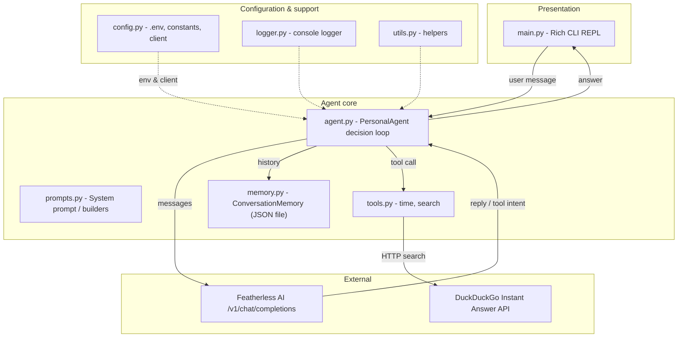

# Architecture

This document describes the architecture of the **Personal AI Agent**: the
modules, their responsibilities, and how they interact.

## 1. High-level diagram



## 2. Module responsibilities

### `src/config.py`
Central configuration. Loads `.env`, validates that `FEATHERLESS_API_KEY`
exists, exposes constants (paths, timeouts, limits) and a cached,
lazily-created OpenAI-compatible client via `get_client()`.

### `src/logger.py`
Idempotent `logging` setup - one console handler at INFO level. A shared
`logger` instance is imported by all modules.

### `src/utils.py`
Pure helpers: `format_timestamp`, `iso_timestamp`, `divider`, `truncate_text`,
and `parse_tool_json` (best-effort JSON extraction from model output).

### `src/prompts.py`
Holds `SYSTEM_PROMPT` (identity, style, tool contract), the `TOOL_CATALOG`
sent to the model, `build_messages()` (system + history + current user turn),
and `build_tool_result_prompt()`.

### `src/memory.py`
`ConversationMemory` persists messages to `memory/chat_history.json`.
API: `load()`, `save()`, `add_message()`, `clear()`, `get_recent()`, `size()`.
Writes are atomic; corrupt files are backed up and reset.

### `src/tools.py`
External tools with a uniform contract:

```json
{ "status": "success | failed | error", "tool": "<name>", "result": "..." }
```

- `time` - system clock.
- `search` - DuckDuckGo Instant Answer API via `requests` with timeouts and
  one retry.

`execute_tool()` is the router; `list_tools()` exposes metadata for the CLI.

### `src/agent.py`
`PersonalAgent` implements the request pipeline:

1. `memory.add_message("user", ...)` - persist the input.
2. Load the recent window (`get_recent(max_history)`).
3. Build messages (`prompts.build_messages`).
4. Call the LLM; parse the reply:
   - JSON tool call?  -> `execute_tool()` -> feed result back -> repeat.
   - Plain text?      -> that is the final answer.
5. Persist the assistant answer.
6. Return `{answer, tool_used, tool_result, error}`.

A budget of `MAX_TOOL_ROUNDS = 2` tool executions prevents infinite loops.

### `src/main.py`
Rich-powered REPL. Renders the banner, dispatches slash-commands
(`help`, `history`, `clear`, `tools`, `exit`), streams a "Thinking..." status
while the agent works, and prints the answer as Markdown.

## 3. Data flow (end-to-end)

```
User message
   -> ConversationMemory.save("user", ...)
   -> build_messages(history, input)
   -> POST /v1/chat/completions (Featherless AI)
   -> if tool intent: execute_tool() -> result dict
      -> build_tool_result_prompt(result) -> second LLM call
   -> final answer text
   -> ConversationMemory.save("assistant", ...)
   -> printed to terminal
```

## 4. Design decisions

| Decision | Rationale |
| --- | --- |
| OpenAI SDK against Featherless | Featherless exposes an OpenAI-compatible API; SDK gives retries, typing. |
| JSON tool negotiation instead of native tool-calling | Works reliably across many open models served by Featherless. |
| Atomic writes + backup on corruption | Protects user data, never crashes. |
| Lazy cached client | Tests and tools can import without an API key. |
| `Path(__file__).resolve().parent.parent` for roots | App works regardless of the current working directory. |

## 5. Where assets live

- `assets/architecture.png` - rendered version of this diagram.
- `assets/workflow.png` - rendered version of the request workflow.
