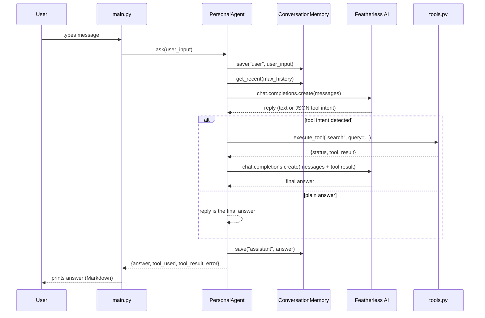
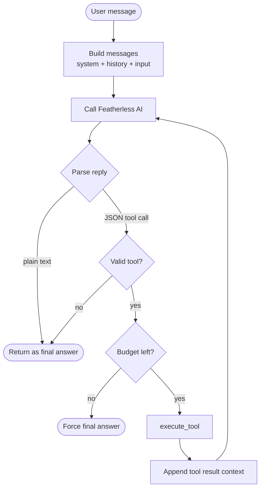

# Workflow

This document describes the **runtime workflow** of the Personal AI Agent:
what happens from the moment a user types a message until the answer is
printed.

## 1. Interactive loop

## 2. Tool decision flow

## 3. Step-by-step detail

1. **Capture** - `main.py` reads the user's line.
2. **Persist input** - the message is saved immediately so nothing is lost.
3. **Context window** - the last `MAX_HISTORY_MESSAGES` (default 40) messages
   are loaded from memory.
4. **Build prompt** - `prompts.build_messages` assembles system prompt +
   history + current turn.
5. **First LLM call** - the model either answers directly or emits a JSON tool
   intent.
6. **Tool execution** - a valid intent is routed by `execute_tool`. Tools
   return the structured `{status, tool, result}` dict.
7. **Second LLM call** - the tool result is injected and the model composes
   the final answer grounded in that data.
8. **Persist answer** - `memory.save("assistant", answer)`.
9. **Render** - the answer is printed; tool usage is flagged for the user.

## 4. REPL commands

| Input | Behaviour |
| --- | --- |
| any text | Sent to the agent (`ask`). |
| `help` | Print commands and tool list. |
| `history` | Show last 10 saved messages. |
| `clear` | Erase all memory. |
| `tools` | List external tools. |
| `exit` / `q` / Ctrl-C | Graceful shutdown. |

## 5. Failure paths

| Point of failure | Behaviour |
| --- | --- |
| Missing API key | Startup aborts with a clear message. |
| LLM network/API error | Logged; user sees a friendly fallback message. |
| Tool HTTP timeout/error | `status: "error"` result; agent answers from knowledge. |
| Model emits garbage JSON | Treated as a plain answer, never crashes. |
| Tool budget exhausted | Agent is forced to produce a final answer. |
